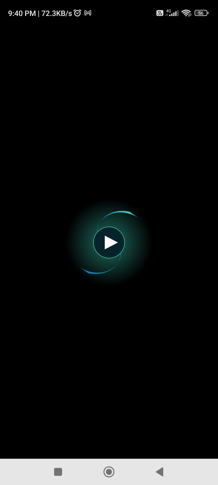
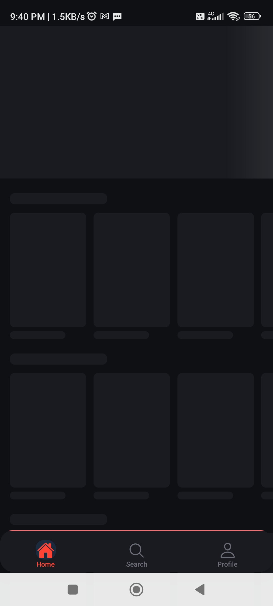
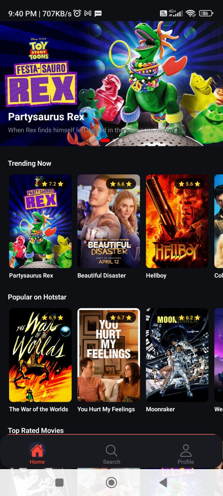
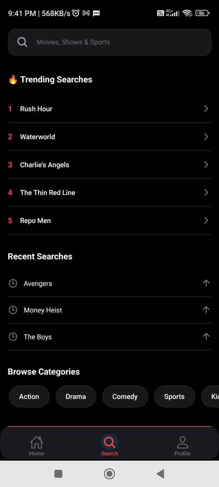
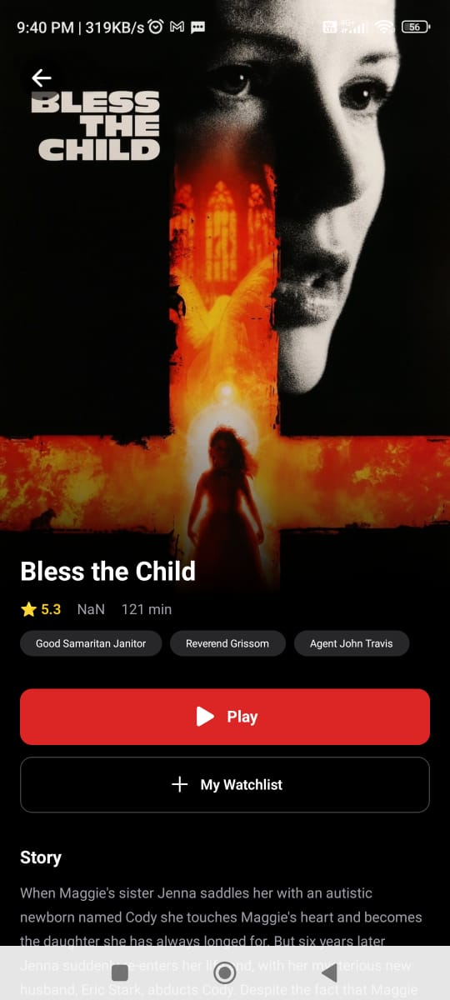
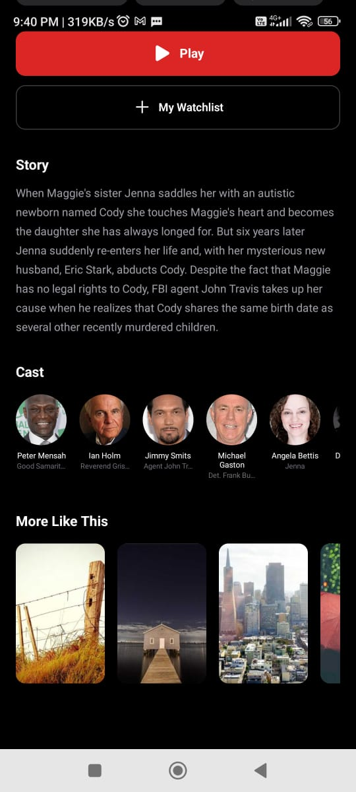
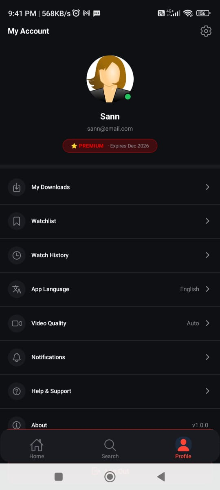

# 🎬 Hotstar Clone — React Native (Expo)

A high-fidelity, production-ready mobile application inspired by Disney+ Hotstar. Built with Expo, TypeScript, and NativeWind (Tailwind CSS for React Native).

---

## 📱 Screenshots


| Splash | Home | Search | Detail | Profile |
|--------|-------|------|
|  |  |  |  |  |
 |  |


---

## 🚀 Features

- ✅ Animated splash screen with fade + scale animation
- ✅ Auto-advancing hero banner carousel with pagination dots
- ✅ Horizontal content rows with real movie data from live API
- ✅ Shimmer skeleton loaders on every screen and component
- ✅ Debounced search with trending suggestions and grid results
- ✅ Full movie detail screen with cast, story, and related content
- ✅ Profile screen with avatar, plan badge, and settings menu
- ✅ Pull-to-refresh on home feed
- ✅ Empty states and error states with retry
- ✅ Dark theme throughout

---

## 🛠️ Tech Stack

| Category | Technology |
|----------|-----------|
| Framework | Expo (SDK 54, Managed Workflow) |
| Language | TypeScript (Strict Mode) |
| Navigation | Expo Router (File-based routing) |
| Styling | NativeWind v4 (Tailwind CSS for RN) |
| Animations | React Native Reanimated v4 |
| Data | jsonfakery.com (Real paginated movie API) |
| Icons | @expo/vector-icons (Ionicons) |
| Gradients | expo-linear-gradient |

---

## 📂 Project Structure

```
hotstar_clone/
├── app/
│   ├── _layout.tsx                  
│   ├── (tabs)/
│   │   ├── _layout.tsx      
│   │   ├── index.tsx
│   │   ├── search.tsx 
│   │   └── profile.tsx 
│   └── detail/
│       └── [id].tsx         
│
├── src/
│   ├── api/
│   │   ├── mockData/
│   │   │   ├── home.ts      
│   │   │   ├── search.ts   
│   │   │   └── profile.ts   
│   │   └── services.ts      
│   │
│   ├── components/
│   │   ├── common/
│   │   │   ├── AnimatedSplash.tsx
│   │   │   ├── Skeleton.tsx    
│   │   │   └── EmptyState.tsx      
│   │   ├── home/
│   │   │   ├── HeroBanner.tsx   
│   │   │   ├── ContentRow.tsx  
│   │   │   ├── ContentCard.tsx 
│   │   │   ├── HomeSkeleton.t
│   │   │   ├── HeroBannerSkeleton.tsx
│   │   │   ├── ContentRowSkeleton.tsx
│   │   │   └── ContentCardSkeleton.tsx
│   │   ├── search/
│   │   │   ├── SearchBar.tsx        
│   │   │   ├── TrendingChips.tsx   
│   │   │   └── SearchResultsList.tsx 
│   │   ├── detail/
│   │   │   ├── CastRow.tsx        
│   │   │   └── DetailSkeleton.tsx   
│   │   └── profile/
│   │       ├── ProfileAvatar.tsx    
│   │       ├── ProfileMenuItem.tsx  
│   │       └── ProfileSkeleton.tsx 
│   │
│   ├── hooks/
│   │   ├── useContentFeed.ts  
│   │   ├── useSearch.ts      
│   │   ├── useProfile.ts      
│   │   └── useMovieDetail.ts  
│   │
│   ├── types/
│   │   └── content.ts         
│   │
│   └── theme/
│       └── colors.ts          
│
├── global.css                 
├── tailwind.config.js         
├── babel.config.js
├── metro.config.js
├── eas.json                 
└── app.json                   
```

---

## 🔄 App Flow

```
App Launch
    ↓
Animated Splash Screen (Reanimated fade + scale)
    ↓
Tab Navigator
├── Home Tab
│     ├── Skeleton Loader
│     ├── Hero Banner Carousel 
│     ├── Trending Now Row
│     ├── Popular on Hotstar Row
│     └── Top Rated Movies Row
│           └── Tap Card → Detail Screen
│
├── Search Tab
│     ├── Search Bar 
│     ├── Trending Chips 
│     ├── Loading Spinner 
│     ├── Grid Results
│     └── Empty State
│           └── Tap Result → Detail Screen
│
└── Profile Tab
      ├── Skeleton Loader
      ├── Avatar + Plan Badge
      ├── Settings Menu Items
```

---

## ⚙️ Architecture Decisions

### Skeleton Loaders
Every screen and component has a matching skeleton that mirrors its real layout exactly — same dimensions, same positions. This avoids layout shift when real data loads and gives a polished, professional feel.

### Performance Optimizations
- `FlatList` configured with `initialNumToRender`, `windowSize`, and `removeClippedSubviews` on every list
- `React.memo` on `ContentCard` and `ContentRow` to prevent unnecessary re-renders
- `useCallback` on render functions and key extractors
- Debounced search to avoid excessive API calls
- `onMomentumScrollEnd` for hero carousel tracking instead of complex `onViewableItemsChanged`

---

## 🏃 Running Locally

```bash
# Clone the repo
git clone https://github.com/YOUR_USERNAME/hotstar-clone.git
cd hotstar-clone

# Install dependencies
npm install

# Start the dev server
npx expo start -c

# Scan QR with Expo Go app on your phone
# or press 'a' for Android emulator
```

---

## 📦 Building APK

```bash
# Install EAS CLI
npm install -g eas-cli

# Login to Expo
eas login

# Build APK for Android
eas build --platform android --profile preview
```

Download link will be provided in the terminal and at [expo.dev](https://expo.dev).

---

## 📡 API

This project uses [jsonfakery.com](https://jsonfakery.com/movies/paginated) — a free paginated movie API that returns real movie data including titles, posters, backdrops, cast members, ratings, and overviews.

Data is mapped to the app's internal `ContentItem` and `MovieDetail` TypeScript interfaces in `src/api/mockData/home.ts`.

---

## 🎯 Assignment Requirements Checklist

| Requirement | Status |
|-------------|--------|
| Expo Managed Workflow | ✅ |
| TypeScript Strict Mode | ✅ |
| NativeWind / Tailwind CSS | ✅ |
| Expo Router (Native Stack + Bottom Tabs) | ✅ |
| Home Screen with Hero + Carousels | ✅ |
| Detail Screen with Rich Metadata | ✅ |
| Profile / Settings Screen | ✅ |
| Skeleton Loaders | ✅ |
| Error & Empty States | ✅ |
| Mock API / Service Layer | ✅ |
| Data-driven Components | ✅ |
| FlatList Performance Props | ✅ |
| React.memo + useCallback | ✅ |
| Animations (Reanimated) | ✅ |
| Pull-to-Refresh | ✅ |
| Safe Area Management | ✅ |

---

## 👩‍💻 Author

Built by **Neha Gupta**
---

## 📄 License

This project is for educational and portfolio purposes only.
Disney+ Hotstar is a trademark of The Walt Disney Company.
